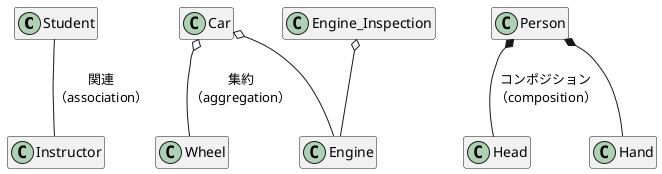
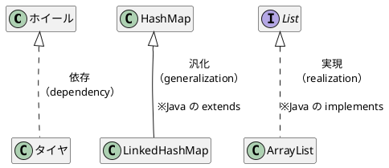
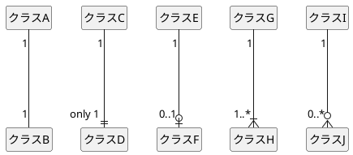
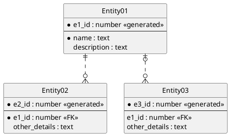

### クラス図

#### クラス間の関係

##### Association vs Aggregation vs Composition
Aggregation and Composition are subsets of association meaning they are specific cases of association. In both aggregation and composition object of one class "owns" object of another class. But there is a subtle difference:

Aggregation implies a relationship where the child can exist independently of the parent. Example: Class (parent) and Student (child). Delete the Class and the Students still exist.

Composition implies a relationship where the child cannot exist independent of the parent. Example: House (parent) and Room (child). Rooms don't exist separate to a House.

####

依存とは、片方のインスタンスを変更すればもう片方のインスタンスに変更が生じることを表す。

#### カーディナリティ

#### クラス図
~~~plantuml
@startuml

abstract class AbstractList
abstract AbstractCollection
interface List
interface Collection

List <|-- AbstractList
Collection <|-- AbstractCollection

Collection <|- List
AbstractCollection <|- AbstractList
AbstractList <|-- ArrayList

class ArrayList {
  Object[] elementData
  size()
}

enum TimeUnit {
  DAYS
  HOURS
  MINUTES
}

annotation SuppressWarnings

@enduml
~~~

#### ER図
